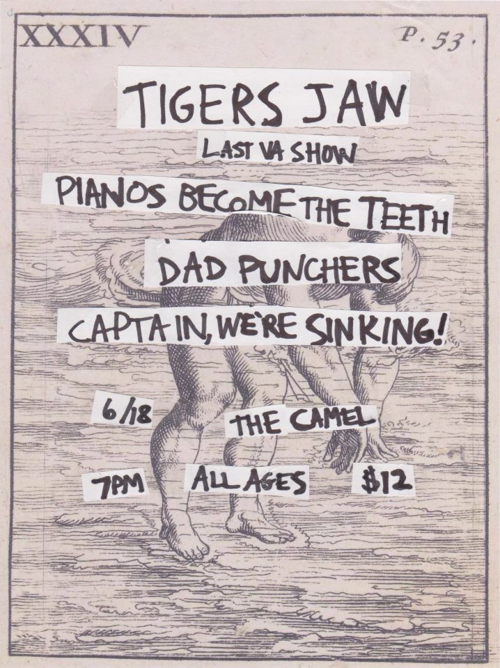

Talked with a friend today about the Tigers Jaw show at the Camel in RVA over 10 years go, I can't remember if they had one or two shows there that year. You can find videos of parts of the show on Youtube. it was one of those times when the perfect band visited the perfect venue. I'm not sure I've been to a show before or since with that kind of energy. 

Went down to the river today and found a new way down to the old trail since Texas Beach is still "shut down" because of the bridge construction. I'm not sure if I prefer winter or summer days on the river. Obviously theres no swimming in the winter but its a different vibe looking out over the water when the leaves have dropped and the air is brutal. Continued after the youtube vid. 

  
  
  
  

In case the future breaks this embed its the official music video for Tiger Jaw's new single "Head is Like a Sinking Stone"

<iframe width="560" height="315" src="https://www.youtube.com/embed/9XiuaoT0Zzg?si=o82e1dzJK5kVfueM" title="YouTube video player" frameborder="0" allow="accelerometer; autoplay; clipboard-write; encrypted-media; gyroscope; picture-in-picture; web-share" referrerpolicy="strict-origin-when-cross-origin" allowfullscreen></iframe>

Stumbled across some rocks someone had painted like those magnets you can put up on the refrigerator. You rearrange them to make different sentences and things. There were homeless encampments along the trail, probably amounting to 3-4 people. We used to walk the railroad tracks until we were far enough away where no one would bother us. Its what they were doing to. 

When Tigers Jaw played the Camel that year it was billed as "The Last VA Show" that ended up not being true. They were breaking up, or getting ready to at that time I guess. But it definitely was the last of something. 

As I get older I'm learning you should never feel goofy for taking pictures or recording something. But the real fight is in saving everything, copying it, colating it.  
