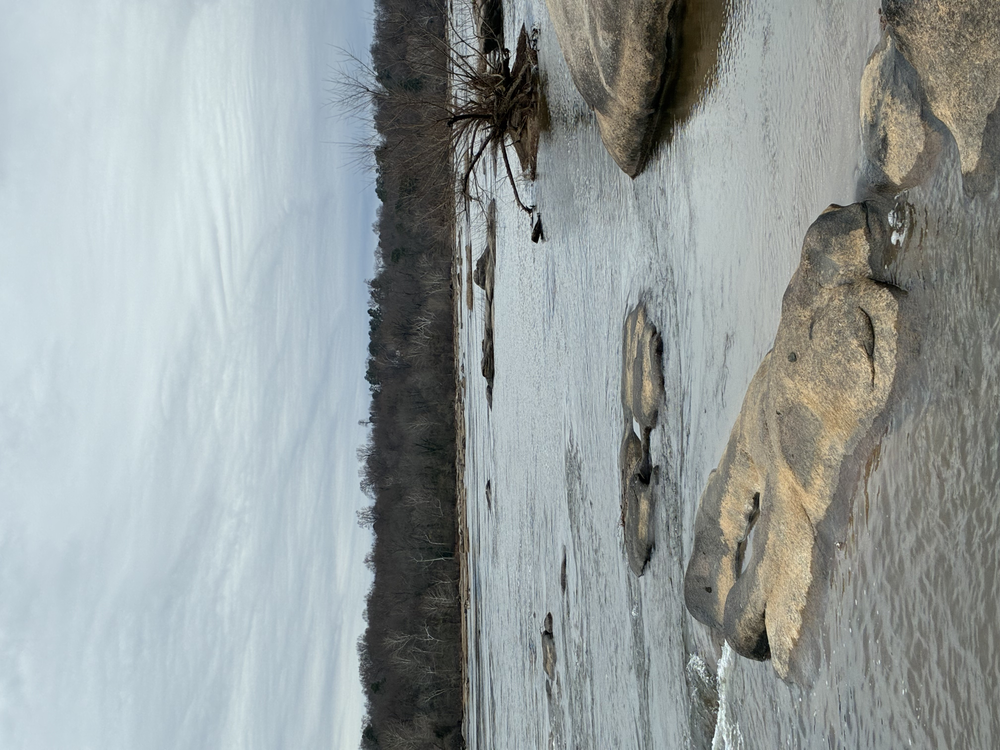

So finally found the way back to Texas Beach. Overcast. Cold. River was low. Just walking and talking, something I haven't done in a long time. The James is such a vibrant place in the summer, and then skeletal in the winter. Geese and Gulls and Cormorants maybe the occasional Heron circling, landing, eating dipping in and out of the water. We sure are lucky.

  
  
  

