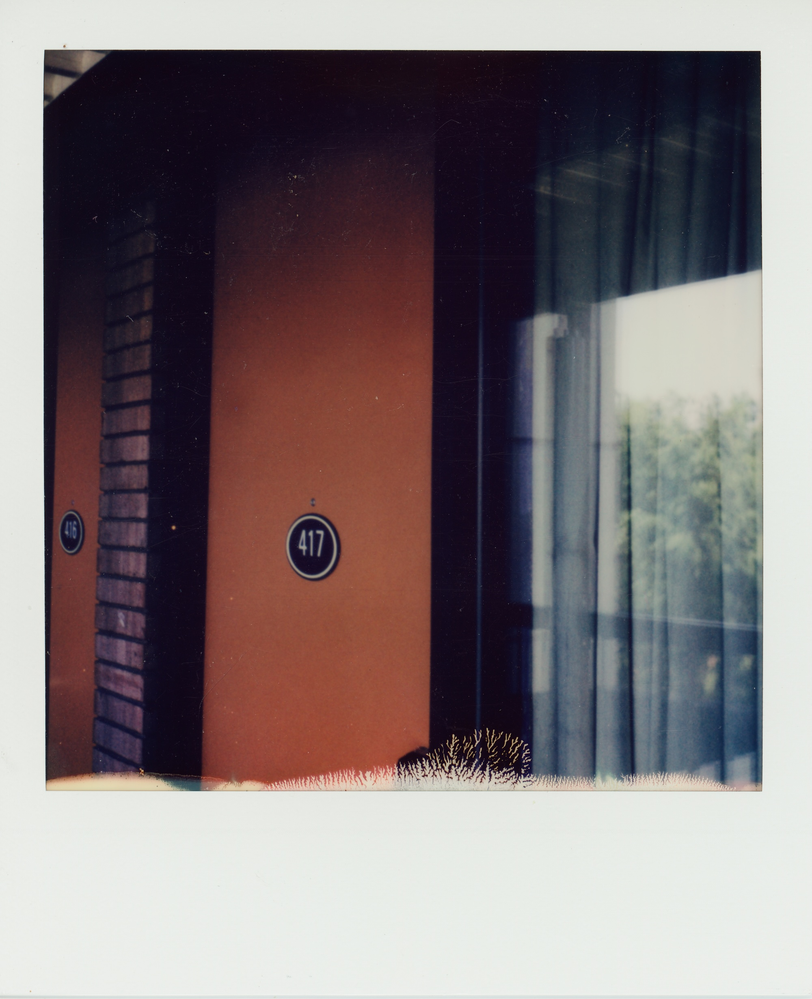
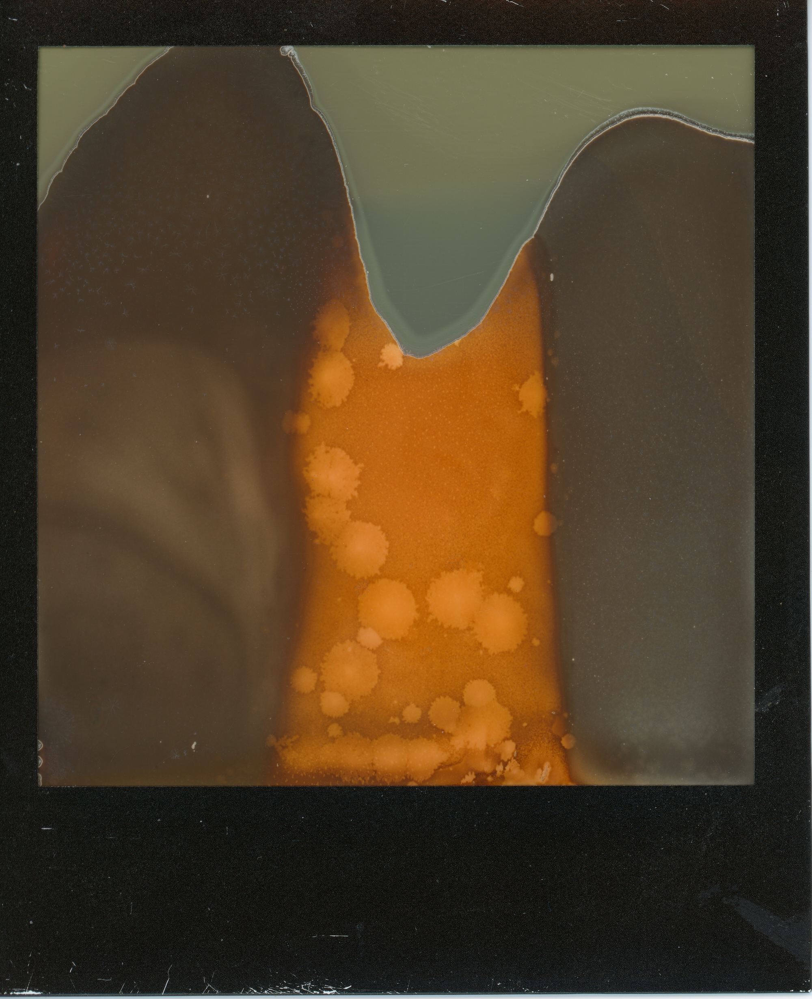
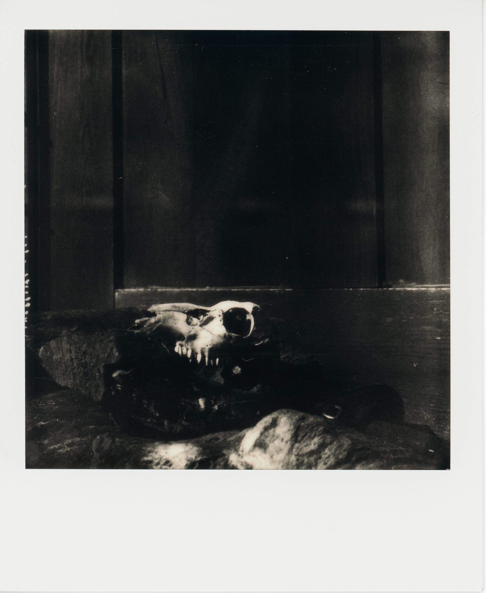
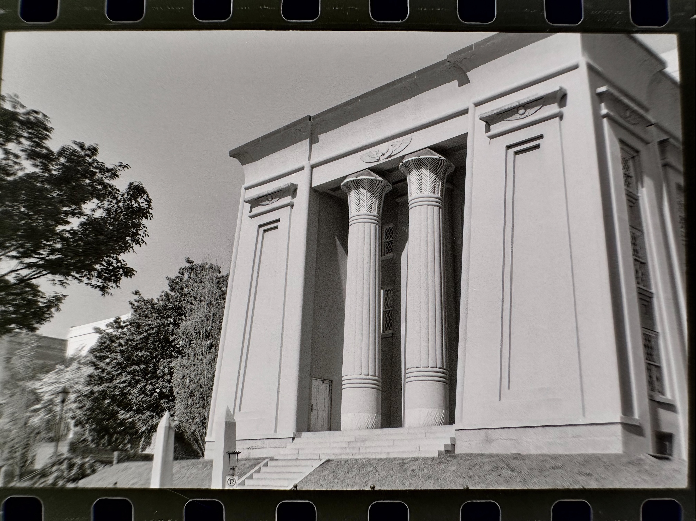

Looking through old photo albums and orphaned folders. My favorite thing to find is old scanned polaroids. Even scanned they always give this very real feeling that no other photo really does. Even failed frames like the second one below. I love #3 for the softness and luminance of the skull and the graininess behind the barn door. 

Number 1 is a little different. Its a picture of a place. There are all kinds of places that you can inhabit in life. Some you can keep going back to again and again. Some of them are only available to you for brief moments or under special circumstances. This door blinked into my existence for a couple weeks and then was gone for good, never to return again. It's a portal into a different world. I'm always reminded of the Golden Compass, in it doors open and close, but big, consequential and real doors, portals that represent a shift in reality, a changing of things that never quite go back. We always presume that doors work the same in the other direction but time's a trap and most of the ways we pass are one way.  

  
  
  
  

